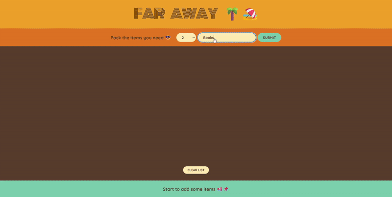

# Trip Packages Manager 🌍✈️


</br>

## Preview

[Live Preview: trip-packages-lmvi.vercel.app](https://trip-packages-lmvi.vercel.app/)



## Overview

A modern, interactive trip management application built with React that allows users to:

- Create and organize travel packages
- Track packing items with smart checklists
- View travel packages statistics and progress
- Manage trip essentials in one place

## Features

✅ Smart packing checklist with item  
✅ Real-time statistics tracking  
✅ Responsive, mobile-friendly interface  
✅ Persistent local storage for package data  
✅ Clean, minimal design focused on usability

## Tech Stack

- 🧱 **Framework**: React.js (Vite powered)
- 🎨 **Styling**: CSS Modules / BEM Methodology
- ✅ **Validation**: Form validation
- 📦 **State Management**: React Context API
- 📦 **Deployment**: Vercel

## Folder Structure

```bash
trip-packages/
├── public/                  # Static assets (e.g., images, icons)
├── src/
│   ├── Components/          # Reusable UI components
│   │   ├── Form.jsx         # Form component
│   │   ├── Head.jsx         # Header component
│   │   ├── PackingList.jsx  # Packing List Component
│   │   └── Stats.jsx        # Statisic Component
│   ├── style/               # Global styles
│   │   └── App.css
│   ├── App.jsx              # Root component
│   └── main.jsx             # App entry point for Vite
├── .gitignore               # Files to ignore by Git
├── eslint.config.js         # ESLint configuration
├── index.html               # Vite's HTML entry
├── package-lock.json        # Dependency lock file
├── package.json             # Project metadata and dependencies
├── README.md                # Project documentation
└── vite.config.js           # Vite configuration

```

## Getting Started

### Prerequisites
- Node.js (v18+ recommended)
- npm or yarn

### Installation

```bash
git clone https://github.com/Sovitou/trip-packages.git
cd trip-packages
npm install
npm run dev
```
